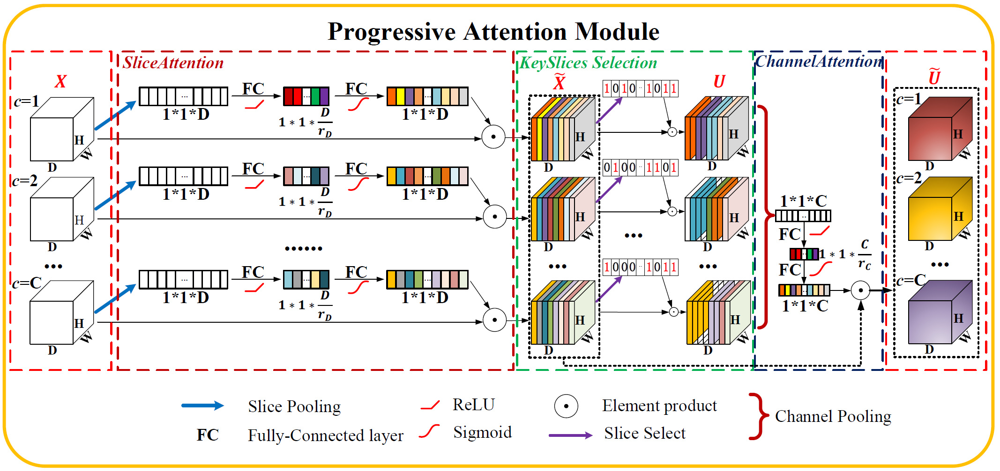

# AttentionBased-MIS
This repository provides the code for "Progressive Attention Module for Segmentation of Volumetric Medical Images". 
Our work is accepted by [Medical Physics][paper_link].
[paper_link]: https://aapm.onlinelibrary.wiley.com/doi/10.1002/mp.15369



Medical Image Segmentation Based on Attention mechanism(Fine-Tune for natural image[semantic/instance] segmentation).

This project is dedicated to 
- Collecting and re-implementing basic models and different attention mechanisms, transforming them modular and portable.
- Proposing  a novel attention mechanism ———— **'Slice Attention'** and **'Progressive Attention Module'** tailored for 3D data Segmentation.

Main purpose is used in 3D Medical Image Segmentation. Fine-tune for Other CV tasks need attention is easily meanwhile.


## dataset
We have used three medical image dataset,both 3D MRI format.You can use other formats like CT only need to constrcuct a concrete datatset loader
in `/data`.

| Dataset | Link |
| ------------- | ------------- |
|BraTS 2018 dataset | [link](https://www.med.upenn.edu/sbia/brats2018/data.html)|
|MALC    dataset| [link](http://www.neuromorphometrics.com/2012_MICCAI_Challenge_Data.html)|
|HVSMR   dataset| [link](http://segchd.csail.mit.edu/)|


## models
This section include basic model(for segmentation or feature extraction) and different attention mechanisms.Each attention mechanism 
can recalibrate multi-dim feature maps across their own functional domain.

Most attention mechanisms can be modularized and integrated into any sub feature maps(e.g. each encoder in 3D UNet or each block in VNet) 
if not special noted.

All models and basic modules are in `/models`,We provide the pre-trained Models in [Model_zoo.md](https://github.com/Puzzled-Hui/AttentionBasedMIS/blob/master/Model_zoo.md):

Here,we integrate and provide brief description for basic segmentation models and attention modules used in our experiments. 
Most of them have conducted and you can find pretrained models in **Model_zoo.md**. 
Some modules have not finished and we will keep conducting experiments and updating this project.

### Basic Segmentation models tailored for Medical Images(Both 2D and 3D)

| Module | Paper | Name |
| ------------- | ------------- | ------------- | 
| 3D UNet | [link](https://arxiv.org/pdf/1606.06650.pdf) | 3D UNet |
| VNet | [link](https://arxiv.org/pdf/1606.04797.pdf) | VNet |
| U-Net | [link](https://arxiv.org/pdf/1505.04597.pdf) | 2D UNet |
| DeepMedic | [link](https://www.sciencedirect.com/science/article/pii/S1361841516301839) | DeepMedic |
| VoxResNet | [link](https://arxiv.org/pdf/1608.05895.pdf) | VoxResNet |
| H-DenseUNet | [link](https://arxiv.org/pdf/1709.07330.pdf) | H-DenseUNet |

### Basic Segmentation models tailored for Natural Image Segmentation

| Module | Paper | Name |
| ------------- | ------------- | ------------- | 
| FCN | [link](https://arxiv.org/pdf/1411.4038.pdf) | FCN |
| DeepLabV3+ | [link](https://arxiv.org/pdf/1802.02611.pdf) | DeepLabV3+ |


### Attention Module

| Module | Paper | Name |
| ------------- | ------------- | ------------- | 
| Squeeze-and-Excitation | [link](http://www.robots.ox.ac.uk:5000/~vgg/publications/2018/Hu18/hu18.pdf) | SE |
| Convolutional Block Attention Module | [link](https://eccv2018.org/openaccess/content_ECCV_2018/papers/Sanghyun_Woo_Convolutional_Block_Attention_ECCV_2018_paper.pdf) | CBAM |
| Project&Excitation | [link](https://arxiv.org/pdf/1906.04649.pdf) | PENet |
| Attention U-Net | [link](https://arxiv.org/pdf/1804.03999.pdf) | AG |
| AnatomyNet | [link](https://arxiv.org/abs/1808.05238) | AnatomyNet |
| Progressive Attention Module | [link](https://aapm.onlinelibrary.wiley.com/doi/10.1002/mp.15369) | PANet |
| Class Activation Map | [link](http://cnnlocalization.csail.mit.edu/Zhou_Learning_Deep_Features_CVPR_2016_paper.pdf) | CAM |
| Spatial Transformer Net | [link](http://papers.nips.cc/paper/5854-spatial-transformer-networks.pdf) | STN |
| Split Attention | [link](https://arxiv.org/pdf/2004.08955.pdf) | SpA |


## Train and Test 

To fully understand the architecture of our projects, please take a reference to 
- [Visualization of the projects arch](https://github.com/Puzzled-Hui/AttentionBasedMIS/blob/master/sources/project%20arch.PNG)

The Technical Report has clearly demonstrate the procedure of training and test, including loading data, pre-processing data,
loading pretrained models,  training and testing models, saving model weights and other log info, etc.

### Train Demo
You can use the following command to train a model, **demo_train.py** is a script with detailed annotations.

```
python demo_train.py --dataroot $DATASET_DIR \
                     --name $EXPERIMENT_NAME \
                     --checkpoints_dir $MODEL_SAVEDIR \
                     --model $MODEL \
                     --dataset_mode $DATASET_MODE \
                     --in_channels $INPUT_CH \
                     --out_channels $OUTPUT_CH \
                     --gpu_ids $GPU_IDS
```

### Test Demo
You can use the following command to test a model, **demo_test.py** is a script with detailed annotations.

```
python demo_test.py  --dataroot $DATASET_DIR \
                     --name $EXPERIMENT_NAME \
                     --checkpoints_dir $MODEL_LOADDIR \
                     --model $MODEL \
                     --dataset_mode $DATASET_MODE \
                     --in_channels $INPUT_CH \
                     --out_channels $OUTPUT_CH \
                     --gpu_ids $GPU_IDS
```

## Environment
The research in this study is carried out on both Windows10 and Ubuntu16.04 with 4 NVIDIA 1080Ti GPU with 44GB memory.

The deep learning framework is PyTorch≥1.1.0 and Torchvision ≥0.4.0.

Some python libraries are also necessary, you can use the following command to set up.

```
pip install -r requirements.txt
```


## Citiation
If you use AttentionBased-Medical-Image-Segmentation in your research or wish to refer to the baseline results published in the Model_zoo.
Please cite this article as *doi: 10.1002/mp.15369*
